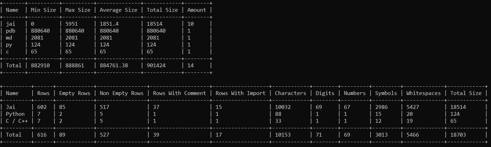

# File-Analyzer
A fast and light file analyzer tool designed for programmers

## Features

- Designed for projects
    - Where there are images, audios and codes; get all the information about them!
- Specific languages (TODO)
    - We've introduced some specific data from various languages, like the amount
    of each symbols in brainfuck, the amount of assembly labels, etc.
    See table below of supported files
- Exclusion (TODO)
    - You can select a folder or an extension of files to exclude, so the analyzer will ignore them
- Total
    - See the total of everything, how many files, how many audios, how many rows of code, etc.

### Visual example

### Supported files
- Programming language
    - [x] C / C++
    - [ ] C#
    - [x] Jai
    - [ ] Java
    - [x] Python
    - [ ] Rust
    - [ ] Cobol
    - [ ] Fortran
    - [ ] Go
    - [ ] Ruby
    - [ ] Kotlin
    - [ ] Lua
    - [ ] V
    - [ ] Odin
    - [ ] R
    - [ ] Matlab
    - [ ] Dart
    - [ ] Brainfuck
    - [ ] Mathematica
    - [ ] Erlang
    - [ ] Elixir
    - [ ] Vim
    - [ ] Beef
    - [ ] JAML
    - [ ] Javascript
    - [ ] Typescript
    - [ ] HTML
    - [ ] CSS
    - [ ] PHP
    - [ ] Bash
    - [ ] Batch
    - [ ] Assembly ASM
    - [ ] Powershell
    - [ ] Scala
    - [ ] Swift
    - [ ] SQL
    - [ ] Julia
    - [ ] Perl
- Image
    - [ ] jpg / jpeg
    - [ ] png
- Video
    - [ ] mp4
    - [ ] gif
- Audio
    - [ ] mp3
    - [ ] wav
    - [ ] flac
    - [ ] ogg

### Obtained info

- General:
    - file amount
    - min file size
    - max file size
    - average file size
    - total file size
- Programming language:
    - rows
    - empty and non-empty rows
    - rows containing comments
    - rows containing imports
    - characters
    - digits and numbers
    - symbols
    - white spaces
    - total size
- Image:
    - min resolution
    - max resolution
- Audio:
    - min length
    - max length
    - total length
- Video:
    - min length
    - max length
    - total frames
    - min resolution
    - max resolution
